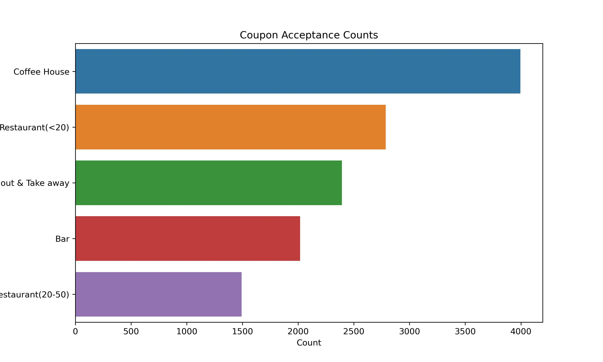
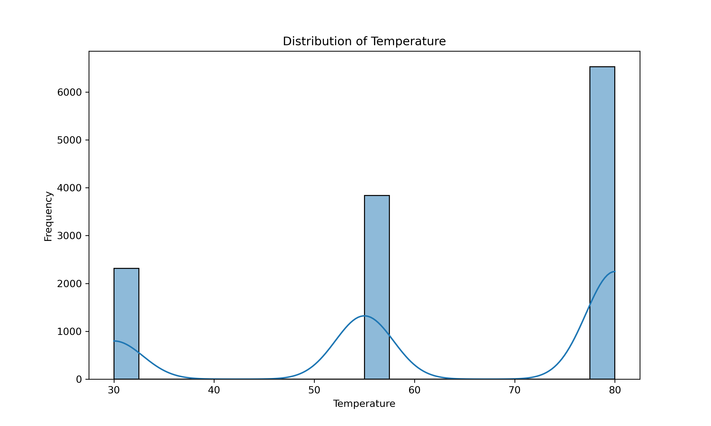
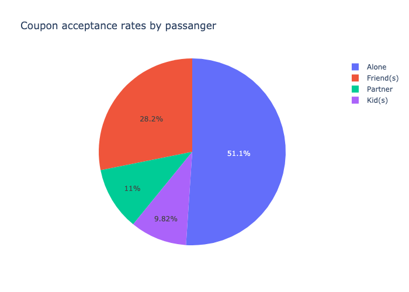
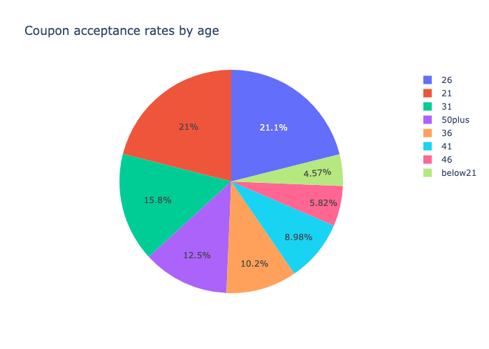
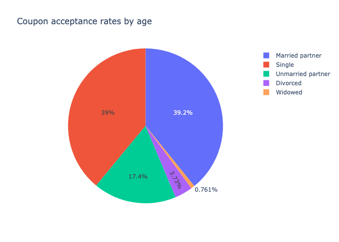
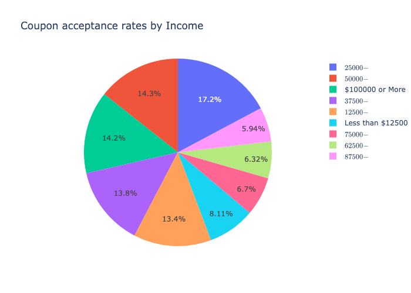
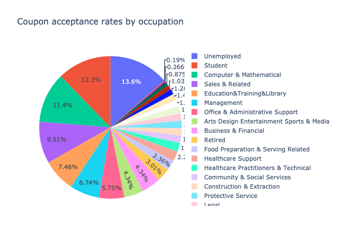

# Will a Customer Accept the Coupon?  

## Dataset investigation and Cleanup:  
1- Make a copy of dataset to apply the data cleanup  
2- High Proportion of Missing Data for the car column:only 108 non-null entries out of 12,684. It's better to drop this column  
3- Moderate or Low Proportion of Missing Data for Bar, CoffeeHouse, CarryAway, RestaurantLessThan20, Restaurant20to50: I replaced the missing values with a new category like 'Unknown'  

**Observations:**  
What proportion of the total observations chose to accept the coupon? Proportion of accepted coupons: 56.84%
Please see the barplot under ./images/coupon_acc.png. The most acceptance coupans were for "Coffee House".  
  
In the warmer wether the frequency of accpeting coupons is higher, Please see the histogram under ./images/temp_dist.png'.  
  

## Investigationg the Bar coupons  
### Q2. What proportion of bar coupons were accepted?  
Proportion of accepted bar coupons: 41.00%

### Q3- Compare the acceptance rate between those who went to a bar 3 or fewer times a month to those who went more.
Acceptance rate for those who went to a bar 3 or fewer times a month: 37.06%
Acceptance rate for those who went to a bar more than 3 times a month: 76.88%

### Q4- Compare the acceptance rate between drivers who go to a bar more than once a month and are over the age of 25 to the all others. Is there a difference?
Acceptance rate for those who went to a bar more than once per month and over 25 years:    68.18%
Acceptance rate for all others: 39.33%

### Q5-5. Use the same process to compare the acceptance rate between drivers who go to bars more than once a month and had passengers that were not a kid and had occupations other than farming, fishing, or forestry. 
Acceptance rate for those who went to a bar more than once per month and their passanger was not a kid with no occupation Farming Fishing & Forestry     71.32%
Acceptance rate for all others: 30.83%

### Q6-Compare the acceptance rates between those drivers who:
**a-** go to bars more than once a month, had passengers that were not a kid, and were not widowed OR  
**b-** go to bars more than once a month and are under the age of 30 OR  
**c-** go to cheap restaurants more than 4 times a month and income is less than 50K.  

group1: go to bars more than once a month, had none kid passengers, and were not widowed  
Acceptance rate for group1: 71.32%  
group2:  go to bars more than once a month, and under age of 30  
Acceptance rate for group2: 72.17%  
group3: go to cheap restaurants more than 4/month and income < 50K  
Acceptance rate for group3: 43.90%  

### Observations:
Based on the provided acceptance rates for various groups related to bar visits, several hypotheses can be formulated about the drivers who accepted the bar coupons:  
**1.	Frequency of Visits to Bars and Coupon Acceptance:**  
•	There appears to be a strong correlation between the frequency of visiting bars and the likelihood of accepting bar-related coupons. Individuals who visit bars more frequently (more than 3 times a month) show significantly higher acceptance rates (76.88%) compared to those who visit 3 times or fewer (37.06%). This suggests that frequent bar-goers are more receptive to promotions related to bars, possibly due to a greater interest in or affinity for bar environments.  
**2.	Age and Lifestyle Factors:**  
•	The acceptance rate for individuals over the age of 25 who visit bars more than once a month is 68.18%, which is considerably higher than the rate for all others at 39.33%. This indicates that older individuals who frequently visit bars are more likely to accept coupons than their younger or less frequent counterparts, perhaps due their income or lifestyle.  
**3.	Impact of Passenger Type and Marital Status:**  
•	Drivers who go to bars more than once a month, have passengers other than kids, and are not widowed (Group 1) show a high acceptance rate of 71.32%. This suggests that social drivers, possibly those who are socially active but without the responsibilities towards children or a spouse, are more inclined to take advantage of bar coupons.  
**4.	Comparison of Younger Drivers and Economic Factors:**  
•	Younger drivers (Group 2), specifically those under the age of 30 who frequently visit bars, also have a high acceptance rate of 72.17%. This group might be more influenced by social activities and offers that align with their lifestyle, such as bar outings.  
•	In contrast, drivers who go cheap restaurants more than four times a month and have an income less than $50K (Group 3) have a lower acceptance rate of 43.90%. The economic factors and the nature of the venue (cheap restaurants vs. bars) might influence their lower acceptance rate, focusing more on budget-friendly options.  

## Overall Conclusion:  
The data suggests that lifestyle, economic status, and social habits (such as frequency of bar visits, age, presence of children, and marital status) significantly influence the likelihood of accepting bar coupons. Marketing strategies aimed at promoting bar-related activities could be more effective if they target individuals based on these factors, especially focusing on more frequent bar-goers and socially active demographics.  

##Independent Investigation##
Using the bar coupon example as motivation, you are to explore one of the other coupon groups and try to determine the characteristics of passengers who accept the coupons.
I chose "restaurant coupons" for investigation. I will analyze acceptance rates based on various attributes such as age, income level, marital status,  presence of children and occupation.

I created a new Dataframe, named "restaurant_coupon" from original data and filled the missing values with the mode (most frequent value)

**What proportion of restaurant coupons  were accepted by each category? **

**Observations**: 
The acceptance rates of coupons show variation based on multiple factors such as age, income, marital status, occupation, and dining frequency. Notably, drivers who often dine alone accept coupons at a higher rate (51%). Among age groups, drivers between 21 and 35 years old show the highest acceptance rates for dining out coupons, totaling 58% across the age brackets of 21, 26, and 31. In terms of marital status, single and married drivers predominantly accept the coupons. Income also plays a significant role in coupon acceptance; drivers earning between $25,000 and $50,000 account for the highest proportion of coupon acceptance (31%), followed by those earning less than $25,000 (21.5%), $50,000 to $75,000 (20.6%), over $100,000 (14.2%), and $75,000 to $100,000 (12.7%). Occupation-wise, unemployed drivers have the highest coupon acceptance rate (13.6%), closely followed by students (12.3%).

# Conclusion: #

The demographic factors like age, income, marital status, and occupation significantly influence the acceptance of restaurant coupons among drivers. Younger drivers, particularly those aged between 21 and 35, are more likely to accept coupons, indicating a potential target demographic for marketing campaigns focused on dining out promotions.
Both single and married drivers are more likely to use coupons, suggesting that relationship status could be a useful factor in segmenting marketing strategies.There is a clear trend where drivers with lower to middle incomes (less than $75,000 annually) are more inclined to accept coupons, with the highest acceptance among those earning between $25,000 and $50,000. This suggests that coupon promotions might be more appealing to drivers looking for budget-friendly dining options.
Unemployed drivers and students show higher rates of coupon acceptance, potentially reflecting greater price sensitivity and openness to discounts among these groups.

Marketing efforts might be particularly effective if they focus on younger drivers, those with lower to middle incomes, and specific groups like students and unemployed individuals, who are more likely to respond to coupon-based promotions.

**Will the Customer Accept the Coupon?** Yes, based on the sample dataset the majority of drivers accepted the coupon.

